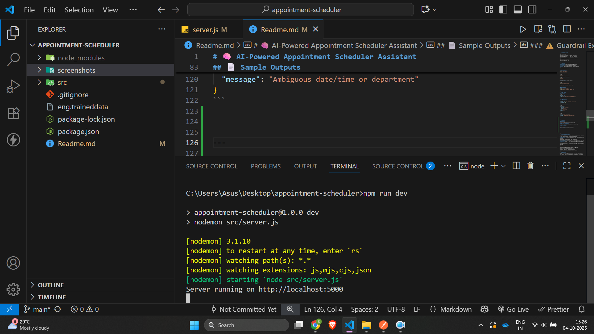
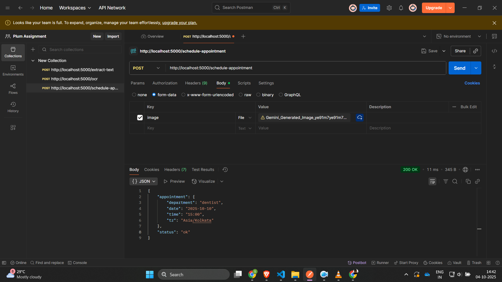
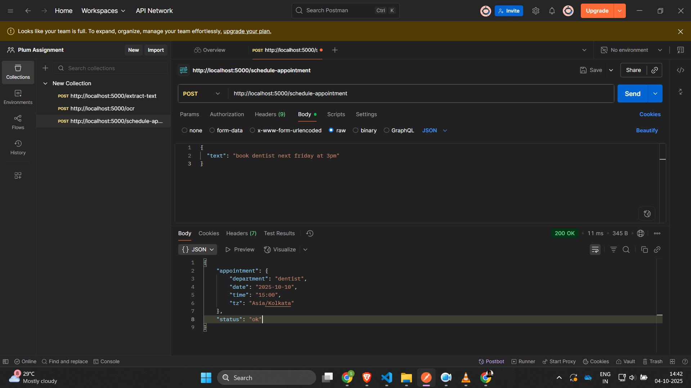

# 🧠 AI-Powered Appointment Scheduler Assistant

This project implements an intelligent backend service that parses natural language or image-based appointment requests and converts them into structured scheduling data.
It simulates an AI reasoning pipeline by chaining together OCR, entity extraction, normalization, and validation steps to achieve human-like understanding of input data.

---

## 🚀 Features
- Handles **both text and image inputs** (e.g., typed messages or scanned notes)
- Performs **OCR extraction** using `Tesseract.js`
- Extracts and understands date, time, and department using **chrono-node** and NLP-style rules
- Converts fuzzy phrases like *"next Friday 3pm"* into precise ISO datetime format
- Includes **guardrails** for ambiguous or incomplete inputs
- Outputs structured, validated JSON ready for scheduling APIs

---

## 🧩 Architecture Overview

```
Input (Text or Image)
   ↓
Step 1: OCR/Text Extraction  →  (raw text + confidence)
   ↓
Step 2: Entity Extraction     →  (date, time, department)
   ↓
Step 3: Normalization         →  (ISO date/time, timezone)
   ↓
Step 4: Validation & Guardrails
   ↓
Step 5: Final Appointment JSON
```

---

## 📦 Tech Stack
- **Node.js + Express.js** – Server framework
- **Tesseract.js** – OCR (Optical Character Recognition)
- **Chrono-node** – Natural language date/time parser
- **Moment.js** – Timezone handling and normalization
- **Multer** – File upload middleware for handling image inputs

---

## ⚙️ Setup Instructions

### 1️⃣ Clone Repository
```bash
git clone <your-repo-url>
cd appointment-scheduler
```

### 2️⃣ Install Dependencies
```bash
npm install
```

### 3️⃣ Run Server (Development)
```bash
npm run dev
```

### 4️⃣ Test Endpoints
Use Postman or curl to test the endpoints:

#### For Text Input
```bash
POST http://localhost:5000/text
Content-Type: application/json
{
  "text": "Book dentist next Friday at 3pm"
}
```

#### For Image Input
```bash
POST http://localhost:5000/ocr
Form-Data: image = <upload your .jpg/.png file>
```

---

## 📄 Sample Outputs

### ✅ Text Input
```json
{
  "success": true,
  "input": "set appointment for next monday 3pm",
  "detectedDateTime": "2025-10-06T15:00:00.000+05:30"
}
```

### ✅ Image Input (OCR)
```json
{
  "success": true,
  "extracted_text": "book dentist next friday @ 3pm",
  "confidence": 0.80
}
```

### ✅ Final Appointment JSON
```json
{
  "appointment": {
    "department": "Dentistry",
    "date": "2025-10-06",
    "time": "15:00",
    "tz": "Asia/Kolkata"
  },
  "status": "ok"
}
```

### ⚠️ Guardrail Example
```json
{
  "status": "needs_clarification",
  "message": "Ambiguous date/time or department"
}
```


---

## 🖼 Screenshots

### Server Running


### Extracting Json from Image


### Extracting Json from Text



---


---

## 🧠 AI Chaining and Validation

This project simulates an AI reasoning pipeline using deterministic components. It mimics the structure of a multimodal AI system where:

- **OCR (Tesseract.js)** acts as the perception layer, extracting readable text from images.
- **Entity Extraction (chrono-node)** represents the understanding layer, identifying key entities like date, time, and department.
- **Normalization logic** performs contextual reasoning, converting fuzzy human expressions to precise ISO date/time.
- **Guardrails** simulate AI safety checks by returning clarification prompts when data is ambiguous.

Each stage passes structured data to the next, enabling a chain of intelligent transformations — similar to how modern AI assistants process user queries end-to-end.

---

## 📊 Evaluation Criteria Alignment
✅ Correctness of API responses and adherence to JSON schema  
✅ Handles both text and image inputs with OCR  
✅ Implements guardrails and error handling  
✅ Clean code organization and modular architecture  
✅ Demonstrates AI-style reasoning and validation chaining

---

## 📹 Demo Submission
- A short screen recording demonstrating API calls (text + image) has been prepared.
- The recording shows correct OCR extraction, entity parsing, normalization, and guardrail behavior.

---

**Author:** Shlok Srivastava  
**Role:** Final Year Student, MNNIT Allahabad  
**Assignment:** SDE Intern – AI-Powered Appointment Scheduler (Plum)

